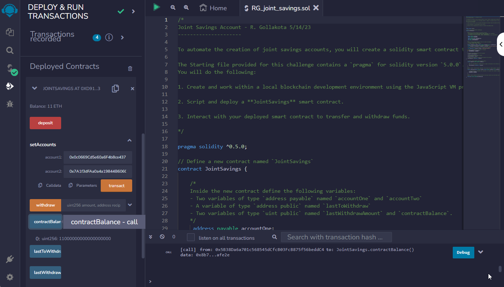

# Unit 20 - "Joint Savings Account"

# Check master branch

File is RG_joint_savings.sol

#### Step 3: Interact with Your Deployed Smart Contract

Now that your contract is deployed, it’s time to test its functionality! After each step, capture a screenshot of the execution, and then save it in a folder named `Execution_Results`. You’ll share this folder with your final submission.

To interact with your deployed smart contract, complete the following steps:

1. Use the `setAccounts` function to define the authorized Ethereum address that will be able to withdraw funds from your contract.

     > **Note** You can either use the following Ethereum addresses or create new, dummy addresses on the [Vanity-ETH](https://vanity-eth.tk/) website, which includes an Ethereum vanity address generator.
     >
     > ```text
     > Dummy account1 address: 0x0c0669Cd5e60a6F4b8ce437E4a4A007093D368Cb
     > Dummy account2 address: 0x7A1f3dFAa0a4a19844B606CD6e91d693083B12c0
     > ```

     

     

     Set up joint accounts:

     

     


Initial Zero Account Balance


1. Test the deposit functionality of your smart contract by sending the following amounts of ether. After each transaction, use the `contractBalance` function to verify that the funds were added to your contract:

    * Transaction 1: Send 1 ether as wei.

      

    * Transaction 2: Send 10 ether as wei.

      

    * Transaction 3: Send 5 ether.

      

    > **Note** Remembering how to convert ether to wei and vice versa can be challenging. So, you can use a website like [Ethereum Unit Converter](https://eth-converter.com/) to ease doing the conversion.

2. Once you’ve successfully deposited funds into your contract, test the contract’s withdrawal functionality by withdrawing 5 ether into `accountOne` and 10 ether into `accountTwo`. After each transaction, use the `contractBalance` function to verify that the funds were withdrawn from your contract. Also, use the `lastToWithdraw` and `lastWithdrawAmount` functions to verify that the address and amount were correct.


Withdraw 10 Eth - accidently withdrew on 5 Wei and then adjusted with deposit and withdraw


---

